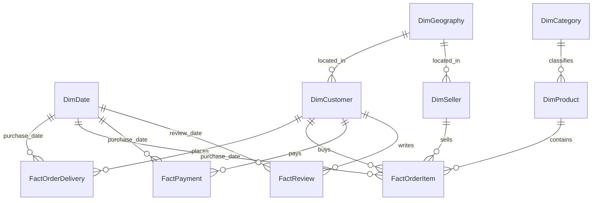

# Olist DW — fact constellation

```mermaid
erDiagram
  DimDate ||--o{ FactOrderDelivery : purchase_date
  DimCustomer ||--o{ FactOrderDelivery : places
  DimGeography ||--o{ DimCustomer : located_in
  DimDate ||--o{ FactOrderItem : purchase_date
  DimCustomer ||--o{ FactOrderItem : buys
  DimSeller ||--o{ FactOrderItem : sells
  DimProduct ||--o{ FactOrderItem : contains
  DimCategory ||--o{ DimProduct : classifies
  DimGeography ||--o{ DimSeller : located_in
  DimDate ||--o{ FactPayment : purchase_date
  DimCustomer ||--o{ FactPayment : pays
  DimDate ||--o{ FactReview : review_date
  DimCustomer ||--o{ FactReview : writes
```

This source can be imported into draw.io via **Arrange → Insert → Advanced → Mermaid**.
